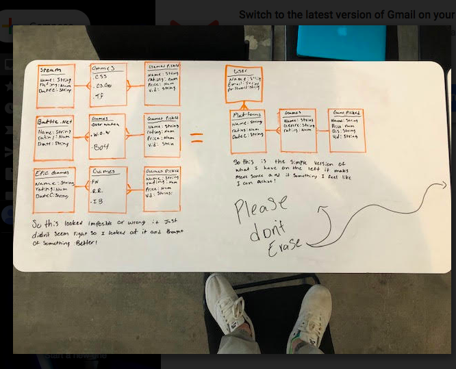

# Project2-FullStack
In this project i will be making a full stack application. I will be using u Node/Express with Mongo/Mongoose, which means that i will learn about what it takes to build a functional application from the ground up.  I will need to run user stories, wireframes, database design, and an app deployed on Heroku by my instructors to get their feedback and approval before I begin coding! I need Remember to keep things small and focus on mastering the fundamentals. I need to Identify what i need to build and accomplish to meet project expectations and identify everything else as stretch goals. If i meet my MVP (Minimum Viable Product) ahead of schedule, I can decide which reach goals to focus on for the remainder of my time.

link to trello its garbage : https://trello.com/b/NAUruq4q/project-2

ERD: 

wirefram: 

